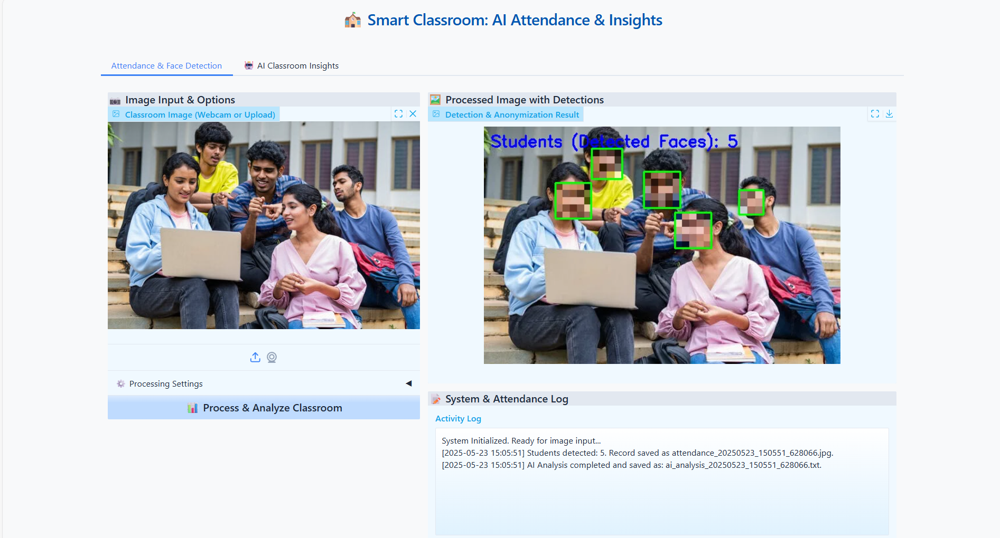

# Face Detection for Smart Classroom

---

## Features

### 1. Student Counts

---

### 2. Privacy Protection
With different options

---

### 3. Low Light Adaption

---

### 4. AI Analysis

 

---

### 5. Log File for Future Review

---

